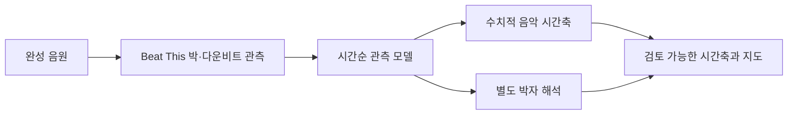

# Joljak

**합주·공연용 멀티트랙 준비를 위한 템포·박자 분석 프로젝트**

완성 음원과 악기별 스템에서 공통 음악 시간축을 얻고, 이를 검토·편집하여 음악·클릭·가이드를 동기화된 파일로 출력하는 Windows 프로그램을 목표로 합니다.

현재는 **분석 알고리즘과 평가 체계를 검증하는 실험 단계**입니다. 실행 가능한 데스크톱 앱, 통합 편집·출력 기능, Windows 설치 패키지는 아직 없습니다. 현재 실험 환경은 Linux/WSL이며 최종 제품은 WSL 없이 Windows에서 실행하는 것을 목표로 합니다.

## 무엇을 분석하나요?

박이 발생한 시각을 찾는 것에서 출발하여 다음 정보를 담은 **템포·박자 지도**를 구성합니다.

- 4분음표 기준 BPM과 구간별 템포 변경
- 박자표, 마디의 시작 위치와 변경
- 고정 클릭을 적용할 수 있는 시간 범위
- 원본 음원의 시간축에 맞춘 박·마디 시각

메트로놈을 기준으로 제작된 스튜디오 음악이 주 대상입니다. 분석 결과는 검토할 수 있는 제안 지도이며, 자유 템포 연주 전반의 자동 복원을 보장하지 않습니다.



현재 재구축 실험은 시간축 계산과 박자 해석을 분리한 [분석 서비스](services/analysis/ENGINE.md)에서 진행합니다. 원음과 가중치를 받는 독립 실행 경로가 있으며, 곡 이름·참조 지도·개인 문서를 추론에 사용하지 않습니다. 박자 해석은 계산된 시간축을 이동시키지 않습니다. 기존 실행기와 청취 검토 묶음은 보존합니다.

## 현재 결과

**2026-10-02 새 분석 엔진의 첫 비교: 아직 정확도 목표 미달**

새 구조의 네 설정을 같은 개발 자료 20곡과 보조 1개에 적용했습니다. 모든 기준을 통과한 완성 음원은 설정별 1–2/20곡이며 보조 자료는 모두 0/1입니다. 기존 재구성기를 대체할 모델로 채택하지 않았습니다. 원음 177.085초의 한 사례는 캐시 없이 프로세스 시작을 포함해 10.440초에 처리했으나, 이 속도가 전체 분석 정확도나 Windows 동작을 보증하지는 않습니다.

구현·검증 범위는 [새 엔진 설명](services/analysis/ENGINE.md), 학습과 대조 조건은 [재구축 실험 설명](experiments/analysis_rebuild/README.md)에 있습니다. 원음·가중치·개별 실행 결과는 로컬 연구 자료로 보존합니다.

**2026-09-27 고정 개발 기준선: 검수된 13곡 중 10곡 통과**

| 범위 | 현재 상태 |
| --- | --- |
| 참조 자료 | 전곡 지도 12곡 + 고정 격자와 자유 엔딩을 구분한 1곡 |
| 통과 기준 | BPM·박자·박·마디·두 종류의 변경 점수 각각 90% 이상 |
| 사건 허용 오차 | 박·마디 ±70ms, 템포·박자 변경 ±500ms |
| 오탐 처리 | 추가 박·마디·변경 감점; 일정한 참조에 거짓 변경이 있으면 해당 항목 실패 |
| 실패곡 | Nocturne, Naysayer, Archspire — Liminal Cypher |
| 해석 | 이미 관찰하고 규칙 개발에 사용한 표본의 결과; 미관측곡 성공률은 미검증 |

이전의 11/11 결과는 알려진 곡의 개별 근거를 연결한 별도 실험입니다. 현재의 공통 경로와 실행 조건이 다릅니다. [곡별 성적·오탐·연구 과정](docs/benchmark.md)에서 두 결과와 한계를 확인할 수 있습니다.

## 코드 읽기

| 목적 | 진입점 |
| --- | --- |
| 새 분석 서비스와 실행 방법 | [ENGINE.md](services/analysis/ENGINE.md), [서비스 진입점](services/analysis/__main__.py) |
| 독립 시간축·박자 해석 | [clock.py](services/analysis/clock.py), [timeline.py](services/analysis/timeline.py) |
| 새 구조의 학습·평가 | [analysis_rebuild](experiments/analysis_rebuild/README.md) |
| 고정 개발 기준선 실행기 | [run_generic_map.py](experiments/tempo_meter_v2/run_generic_map.py) |
| 일정 BPM·마디 격자 | [constant_grid.py](experiments/tempo_meter_v2/constant_grid.py) |
| 단계적 템포 변경 | [tempo_segments.py](experiments/tempo_meter_v2/tempo_segments.py), [barwise_tempo.py](experiments/tempo_meter_v2/barwise_tempo.py) |
| 6/8 해석과 격자 종료 | [compound_meter.py](experiments/tempo_meter_v2/compound_meter.py), [tail_support.py](experiments/tempo_meter_v2/tail_support.py) |
| BPM 정리와 시간 이동 제한 | [plausible_bpm.py](experiments/tempo_meter_v2/plausible_bpm.py) |
| 별도 13곡 평가기 | [score_generic13.py](experiments/tempo_meter_v2/score_generic13.py) |
| 음악 지도 표현·렌더링 | [music_map_contract.py](experiments/analysis_legacy/music_map_contract.py) |

[분석 구조와 실행 방법](docs/analysis.md)은 입력·출력 형식, 선택 규칙과 재현 범위를 설명합니다.

## 음원·모델 없이 테스트하기

Python 3.12의 Linux/WSL 환경에서 저장소 루트를 기준으로 실행합니다.

```bash
python3.12 -m venv .venv
.venv/bin/python -m pip install -r requirements-test.txt

PYTHONPATH=.:experiments/tempo_meter_v2:experiments/analysis_legacy \
OPENBLAS_NUM_THREADS=1 OMP_NUM_THREADS=1 \
.venv/bin/python -m unittest discover \
  -s experiments/tempo_meter_v2 -p 'test_*.py' -q
```

기준선의 40개 테스트는 합성 관측, 음악 시간축, 오탐 억제, 종료 구간 및 클릭 생성 등의 동작을 검증합니다. GPU, 사전학습 가중치, 실제 곡, 회원 계정은 필요하지 않습니다. 단위 테스트 통과는 13곡 벤치마크를 재실행했다는 의미가 아닙니다.

새 엔진의 12개 시간축·실패 처리 검사는 같은 테스트 환경에서 다음과 같이 실행합니다.

```bash
OPENBLAS_NUM_THREADS=1 OMP_NUM_THREADS=1 \
.venv/bin/python -m unittest services.analysis.test_timing -q
```

## 저장소 구성

```text
experiments/
  analysis_rebuild/  새 분석 엔진의 학습·대조·평가
  tempo_meter_v2/    고정 개발 기준선과 과거 비교 실험
  tempo_meter_v3/    보존한 학습·재구성 실험
  tempo_meter_v4/    보존한 독립 검토 문서 후속 실험
  analysis_legacy/   이전 분석, 평가, 참조 준비 및 재사용 유틸리티
  analysis          analysis_legacy를 가리키는 호환 링크
  audio-engine/     향후 엔진 검증용 위치
apps/desktop/       향후 데스크톱 앱
services/analysis/  실험적 독립 분석 서비스
packages/contracts/ 분석 시간축 스키마와 공통 인터페이스
tests/fixtures/     재배포 가능한 테스트 자료용 위치
docs/              공개 기술 설명과 집계 결과
examples/          참조 없이 구성하는 입력 매니페스트 예시
```

`analysis_legacy`는 과거 실험을 재현하는 코드와 공통 유틸리티를 함께 보존합니다. 날짜·11곡·특정 곡을 대상으로 하는 실행기는 해당 실험의 준비된 자료를 요구합니다. 새 독립 분석 경로는 `python -m services.analysis`이며, 검증된 제품 기본값으로 채택한 가중치는 아직 없습니다. 데스크톱·편집·출력 기능은 미구현입니다.

## 자료와 재현 범위

원본 음원, 제작 MIDI·프로젝트, 모델 가중치, 대용량 관측·실행 결과는 배포하지 않습니다. 라이선스와 접근 조건이 서로 다른 자료를 포함하므로, 공개 저장소만으로 원래 13곡을 그대로 재채점할 수는 없습니다.

대신 [곡별 집계 JSON](docs/benchmarks/primary13.json)에 여섯 점수, 오탐·미탐, 평가 범위와 원본 결과의 해시를 제공합니다. 실제 추론에는 별도로 준비한 음원과 가중치가 필요합니다. 외부 모델·데이터의 이용 조건은 각 원출처를 따릅니다.

## 다음 검증 범위

- 기존 통과곡의 성능을 보존하면서 고난도 변박·마디 위상 처리 개선
- 코드를 고정한 뒤 새로운 완성 음원에서 적용 가능성 검증
- 지도 검토, 묶음 편집과 음악·클릭·가이드 출력의 통합
- Windows 실행·패키징과 실제 준비 작업의 수정량·소요 시간 검증
